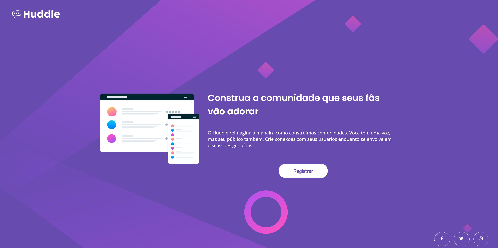

# Frontend Mentor - Huddle landing page with single introductory section solution

Esta é uma solução para o [desafio Huddle landing page do Frontend Mentor](https://www.frontendmentor.io/challenges/huddle-landing-page-with-a-single-introductory-section-B_2Wvxgi0).

## Índice

- [Visão Geral](#visão-geral)
  - [Desafio](#desafio)
  - [Captura de Tela](#captura-de-tela)
  - [Links](#links)
- [Meu Processo](#meu-processo)
  - [Construído com](#construído-com)
  - [O que aprendi](#o-que-aprendi)
  - [Desenvolvimento contínuo](#desenvolvimento-contínuo)
- [Autor](#autor)
- [Agradecimentos](#agradecimentos)

## Visão Geral

### Desafio

O desafio é construir uma landing page e deixá-la o mais próxima possível do design fornecido. Os usuários devem ser capazes de:

- Visualizar o layout ideal da página, dependendo do tamanho da tela do dispositivo.
- Ver os estados de foco para todos os elementos interativos na página.


### Captura de Tela



### Links

- URL do site: [Acesse o site aqui](https://pedro-florentino.github.io/huddle-landing-page-with-single-introductory-section-master/)

## Meu Processo

### Construído com

- HTML5
- CSS
- Flexbox
- Media queries

### O que aprendi

Durante o desenvolvimento deste projeto, aprendi a importância de usar HTML semântico e CSS organizado para criar páginas da web acessíveis e de fácil manutenção. Além disso, aperfeiçoei minhas habilidades em Flexbox e Media queries para criar layouts responsivos.

```css
.text-content {
    display: flex;
    justify-content: center;
    align-items: center;
    flex-direction: column;
    max-width: auto;
    max-height: auto;
}
```

### Desenvolvimento contínuo

Pretendo continuar aprimorando minhas habilidades em:
- Acessibilidade web
- Animações CSS

## Autor

- Website - [Pedro Henrique Marques Florentino](https://github.com/pedro-florentino)
- LinkedIn - [/pedro-florentino](https://www.linkedin.com/in/pedro-henrique-marques-florentino/)

## Agradecimentos

Agradeço à comunidade do Frontend Mentor por proporcionar desafios incríveis que ajudam a melhorar minhas habilidades de desenvolvimento front-end.
